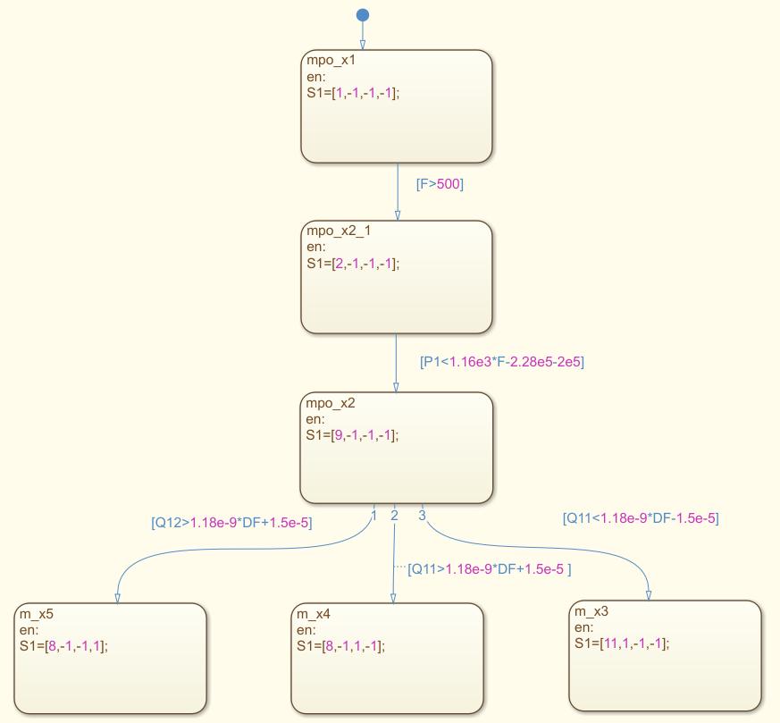
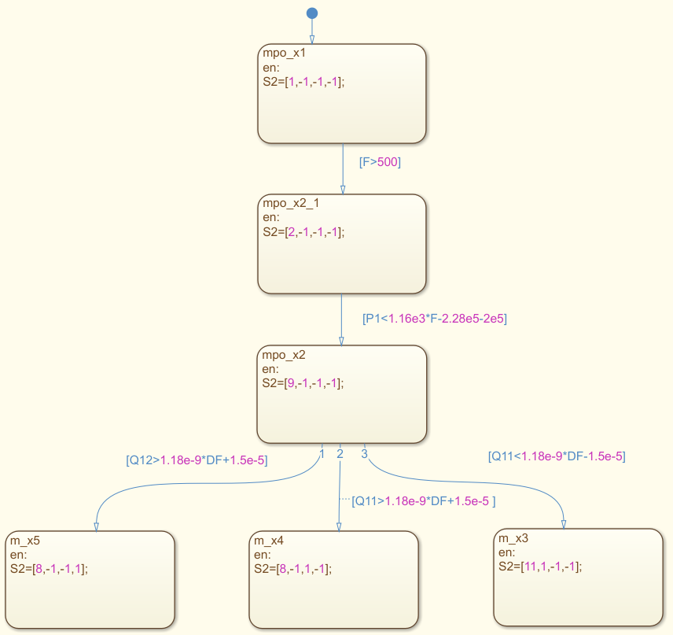

# fault-detection-brake-system

This repository contains a simulation of a novel DES model to detect leakage faults in braking systems, using a decentralized MPO architecture for fault diagnosis.

The  components of the braking system simulation model are developed using Simulink by extending an existing  model of a fixed caliper disc brake model enabled by Simscape [1]. The main components in the simulation model of the braking system are depicted next.

## Fault injection

The fault injection procedure consists on pressure relief valves connected to the primary and secondary hydraulic braking circuits near the master cilinder and calipers. In the 'Fixed-Caliper Disc Brake' subsystem, the simulated fault blocks can be found as presented next. 

The event-driven fault diagnosis scheme has been developed using Stateflow as the fault diagnosis tool for the braking system, which captures the brake system's components (e.g., master cylinder and calipers) as well as the inherent dynamic variables (e.g, force, pressure, position, and volumetric flow). The MPOs designed in StateFlow are shown next.

<table>
  <tr>
    <td></td>
    <td></td>
  </tr>
</table>

The proposed method makes possible the correct detection and isolation of fluid leaks in braking systems.

## To play the simulation:
- Open the file **src/MPO_braking_system.slx**
- Select **Multiple Simulations** under **Inputs & Parameter Tuning** menu
- Load file containing design studies in **data/setup_multiple_simulations.mldatx**
- Save simulation results using the **Simulation Manager** in **.mat** file
- Check results using **src/results_fault_diagnosis.m**. The result for 81 test cases (**data/runs_1_81.mat**) are are compared to expected faults in the primary (**data/fault_1.mat**) and secondary (**data/fault_2.mat**) hydraulic circuits
- The event values defined in the MPOs are obtained from the Linear Regression approach contained in **system_identification_f.m**
- For individual test cases, change value of fault variables **f10, f11, f12, f20, f21, f22**

### REFERENCES

[1] MathWorks, “Fixed caliper disk brake,” [Software]. MathWorks Simulink. Retrieved March 01, 2023, from https://www.mathworks.com/help/sdl/ug/fixed-caliper-disk-brake.html, n.d.